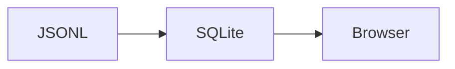
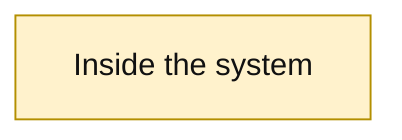

# Agent Sessions Viewer

A local web interface for reading Codex and Claude Code session transcripts.
It renders user and assistant messages as Markdown, remains responsive with very
long conversations, and can follow an active session as new messages arrive.

The application has four small pieces:

- FastAPI discovers transcripts and incrementally indexes visible messages.
- SQLite stores the rebuildable message index.
- React renders only the part of a conversation currently being viewed.
- Caddy serves the frontend and proxies API requests.

Transcript files are mounted read-only and remain the source of truth. The
viewer never modifies them.

## Requirements

- Docker with Docker Compose
- A directory containing Codex and/or Claude Code JSONL session files
- A modern web browser
- Optional: [`just`](https://just.systems/) for concise project commands
- Optional: Python 3.10 or newer for the host-side title and counting scripts

Python, Node.js, and Caddy do not need to be installed on the host for normal
viewer use. Docker builds everything the application requires.

## Quick start

`VIEWER_SOURCES_ROOT` is the deepest common host directory containing every
session directory you want the viewer to access. Docker mounts this one
directory read-only at `/sources`; the source configuration selects directories
inside that mount. Do not choose a broader parent than necessary.

Start by creating local configuration files from the documented examples:

```bash
cp .env.example .env
cp config/sources.example.toml config/sources.toml
```

Both resulting files are gitignored, so machine-specific paths and source names
will not be committed.

### Example: one Codex sessions directory

Suppose the only sessions you want to track are beneath:

```text
/Users/me/.codex/sessions/
├── 2026/
│   └── 09/...
└── ...
```

The deepest directory containing everything you want is the `sessions`
directory itself, so configure `.env` with its absolute path:

```dotenv
VIEWER_SOURCES_ROOT=/Users/me/.codex/sessions
VIEWER_PORT=8080
```

That exact directory becomes `/sources` inside the container:

```text
Host:      /Users/me/.codex/sessions
Container: /sources
```

Therefore `config/sources.toml` uses `/sources`, not the host path:

```toml
[[sources]]
id = "personal"
adapter = "codex"
path = "/sources"
```

### Example: several session directories

Suppose you want all three of these directories:

```text
/Users/me/agent-sessions/          # deepest common parent
├── personal/sessions/             # Codex
├── work/sessions/                 # Codex
└── claude-projects/               # Claude Code
```

Set the common parent as the mount:

```dotenv
VIEWER_SOURCES_ROOT=/Users/me/agent-sessions
VIEWER_PORT=8080
```

The paths beneath that parent retain the same relative layout beneath
`/sources`, so configure all three explicitly:

```toml
[[sources]]
id = "personal"
adapter = "codex"
path = "/sources/personal/sessions"

[[sources]]
id = "work"
adapter = "codex"
path = "/sources/work/sessions"

[[sources]]
id = "claude"
adapter = "claude"
path = "/sources/claude-projects"
```

Here:

- A **source** is one configured directory tree containing session JSONL files.
  It has a stable label, one transcript-format adapter, and one path inside the
  container. A source can contain any number of sessions recursively; it does
  not mean one session and does not have to mean one account.
- `id` is a label chosen by you. It is displayed in the viewer and is not an
  account name. Keep it stable because it becomes part of the indexed session
  identity and browser preferences.
- `adapter` selects the transcript format: `codex` or `claude`.
- `path` is always a path inside the container and must be reachable beneath
  `/sources`. Discovery searches it recursively for supported JSONL files.

Start the application from the repository root:

```bash
docker compose up --build -d
```

Then open <http://localhost:8080>. The first page load discovers available
sessions. Select one and press **Index session** to import its visible messages.
Enable **Watch** only when you want the open session to follow new messages.

The comments in `config/sources.example.toml` repeat these mapping rules. All
configured source paths must resolve beneath the one host directory selected by
`VIEWER_SOURCES_ROOT`.

After changing `.env` or its mounted root, recreate the containers. To inspect
the exact resolved mount before debugging discovery, run:

```bash
docker compose up --build -d
docker compose config
```

## Command shortcuts with `just`

The checked-in `justfile` provides short names for routine commands. Running
`just` without arguments prints the complete command list with descriptions.
It is only a convenience layer; the equivalent Docker commands remain valid.

First-time setup and startup:

```bash
just setup       # Create missing .env, sources.toml, and bookmarks/
# Edit .env and config/sources.toml now.
just up          # Build and start
```

Daily operation:

```bash
just start
just status
just health
just logs
just logs-api
just down
```

Discovery and indexing:

```bash
just discover
just sources
just discover-source personal
just sync personal 019fdbaf
```

Validation and utilities:

```bash
just test
just test-backend
just test-frontend
just title-list
just title-set 019fdbaf-c2ea-7e50-ae8f-8fa79e733904 "Codex frontend UI"
just title-remove 019fdbaf-c2ea-7e50-ae8f-8fa79e733904
just count /absolute/path/to/session.jsonl
just count-as claude /absolute/path/to/session.jsonl
```

## Discover and read sessions

Opening the viewer runs discovery automatically. Discovery catalogs session
metadata but does not import every conversation, which keeps startup fast even
when the source root contains many sessions.

The main workflow is:

1. Use **Rescan** in the sidebar when a new session does not appear.
2. Select a session.
3. Press **Index session** the first time it is opened.
4. Use **Sync now** for a one-time update or enable **Watch** for the active
   conversation.

The sidebar is ordered by latest activity and grouped by day. Its collapse
state is remembered by the browser.

The same operations are available from the command line. A source ID and a
complete session UUID or unique UUID prefix identify a session:

```bash
docker compose exec api viewer sources
docker compose exec api viewer discover
docker compose exec api viewer discover personal
docker compose exec api viewer sync personal 019fdbaf
docker compose exec api viewer sync claude 087e7ac1
```

## Give sessions custom titles

The viewer normally derives a title from the transcript. To assign a persistent
title, copy the complete session ID from the session header and run:

```bash
./scripts/session_title.py set \
  019fdbaf-c2ea-7e50-ae8f-8fa79e733904 \
  "Codex frontend UI"
```

Click **Rescan** in the viewer to display the new title.

List all custom titles:

```bash
./scripts/session_title.py list
```

Remove a custom title and return to the transcript-derived title:

```bash
./scripts/session_title.py remove \
  019fdbaf-c2ea-7e50-ae8f-8fa79e733904
```

The script updates `config/session_metadata.json` atomically. A different
metadata file can be selected by placing `--file PATH` before the command.

The underlying format is intentionally simple:

```json
{
  "019fdbaf-c2ea-7e50-ae8f-8fa79e733904": {
    "title": "Codex frontend UI"
  }
}
```

Session titles are deployment configuration. Live message bookmarks and their
labels are stored in the current browser's local storage. They can also be
exported as durable snapshots from the viewer.

## Reading controls

- **Beginning** and **Latest** move to either end of the session.
- Enter the displayed message number in the **# / Go** control to jump directly
  to that message.
- The star in a message header adds or removes a bookmark.
- **Bookmarks** opens the saved-message list. Bookmark labels are generated
  from message text and can be edited in place.
- **Export backup** atomically overwrites `bookmarks/<session-id>.json` with the
  current list. **Restore backup** confirms and then replaces the browser list
  directly; it does not scan or synchronize the transcript.
- **Fold**, **Collapse all**, and **Expand all** control long message bodies.
- Messages with at least two headings have an **Outline** button. The outline is
  closed by default and provides quick jumps within that message.
- Rendered messages substantially taller than the viewport have a compact
  **Top of message** action at their bottom.
- The session ID, complete message Markdown, and every fenced code block have
  dedicated copy buttons.

Press **Ctrl+F** or **Cmd+F** to search the complete indexed conversation—not
just the messages currently rendered on screen. Enter and Shift+Enter move
between matches, and Escape closes search.

Fold state, live bookmarks, bookmark labels, sidebar state, and Watch
preferences are stored in browser local storage. Bookmark backups are readable,
versioned JSON files in the gitignored `bookmarks/` directory. Neither mechanism
modifies SQLite or transcript files.

## Markdown rendering

User and assistant messages share the same GitHub-flavored Markdown pipeline.
The viewer supports headings, lists, tables, task lists, blockquotes, links,
inline code, fenced code, and raw HTML. Recognized fenced-code languages receive
syntax highlighting.

Headings receive message-scoped anchors, with a small `#` link visible only on
hover. Ordinary same-document Markdown links are resolved inside their own
message without conflicting with identically named headings elsewhere in the
conversation. This lets Codex refer naturally to another section of a long
answer:

```markdown
Implementation details are under [Architecture](#architecture).

## Architecture
...
```

The viewer's **Outline** control already provides a table of contents. These
anchors navigate the currently rendered message; durable links that reopen a
session at a specific heading are not yet part of the URL scheme.

A fenced block tagged `mermaid` is rendered as a Mermaid diagram:

````markdown

````

Use **Raw** in a diagram toolbar to switch between the rendered diagram and its
original Mermaid source. Invalid diagrams display their error and source instead
of disappearing.

When a diagram declares styled classes with `classDef`, the viewer adds a
compact legend beneath the rendered SVG. The class name is used as its label and
the badge reflects its `fill`, `stroke`, and `color` properties:



The legend is derived without changing the Mermaid source or graph layout. It
is shown only in diagram mode and only when styled classes are present.

Raw HTML is not sanitized because this is a single-user viewer for trusted
local transcripts. Caddy binds to `127.0.0.1` by default. Do not expose this
application publicly or use it for untrusted transcript files.

## Synchronization and stored data

The first sync reads the selected transcript. Later syncs start at the last
completely processed byte and inspect only appended JSONL records. Repeating a
sync is safe, and truncating or replacing a transcript rebuilds only that
session.

**Watch** polls the open session every two seconds. It does not scan or import
other sessions in the background. When the viewer is already at the end, new
messages remain in view. When reading earlier messages, an indicator appears
beside **Latest** instead.

Only visible user and assistant text is indexed. Metadata, injected context,
reasoning, tool calls, tool results, attachments, and other non-conversation
records are excluded.

SQLite lives in the Docker volume named `codex-sessions-viewer_viewer-data`.
It is an index, not the source of truth, and can be rebuilt from the JSONL
transcripts.

## Useful operational commands

Check service status and health:

```bash
docker compose ps
curl http://localhost:8080/api/health
```

Follow backend and web-server logs:

```bash
docker compose logs -f api web
```

Rebuild after changing application code:

```bash
docker compose up --build -d
```

Stop the application without deleting the SQLite index:

```bash
docker compose down
```

Delete and rebuild the index only when intentionally starting over:

```bash
docker compose down --volumes
```

## Troubleshooting

### No sessions appear

Run discovery directly and inspect its error:

```bash
docker compose exec api viewer discover
docker compose logs --tail=100 api
```

Then use `docker compose config` to verify `VIEWER_SOURCES_ROOT` and make sure
every path in `config/sources.toml` exists beneath `/sources` in the container.

### A session exists but has no messages

Select it and press **Index session**. The catalog and message index are
separate on purpose. Also remember that tool-only and metadata records are not
displayed as messages.

### Compare a JSONL transcript with SQLite

The diagnostic script counts messages using the same adapter rules as the
backend:

```bash
./scripts/count_session_messages.py /absolute/path/to/session.jsonl
```

Select an adapter explicitly only when automatic detection is insufficient:

```bash
./scripts/count_session_messages.py --adapter codex /path/to/session.jsonl
./scripts/count_session_messages.py --adapter claude /path/to/session.jsonl
```

Its `visible messages` value is the count expected in SQLite after a successful
sync. `jsonl lines` is larger because one transcript contains many kinds of
records.

### The browser still shows an older frontend

After rebuilding the web container, reload the page so the browser fetches the
new hashed JavaScript and CSS assets.

## Development and tests

Run the backend suite in Docker:

```bash
docker compose --profile test run --rm --build backend-tests
```

Run frontend lint and the production TypeScript/Vite build in Docker:

```bash
docker compose --profile test run --rm --build frontend-check
```

For local development, the backend requires Python 3.14 and
[uv](https://docs.astral.sh/uv/), while the frontend uses Node.js and npm:

```bash
cd backend
uv run --group dev pytest

cd ../frontend
npm ci
npm run lint
npm run build
```

## HTTP API

The React frontend uses these endpoints:

```text
GET  /api/health
GET  /api/sessions
POST /api/sessions/discover
GET  /api/sessions/{source_id}/{session_id}
GET  /api/sessions/{source_id}/{session_id}/messages?start=0&limit=30
GET  /api/sessions/{source_id}/{session_id}/search?q=substring
POST /api/sessions/{source_id}/{session_id}/sync
```
